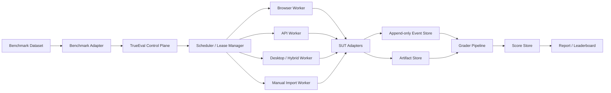

# TrueEval 统一评测工作流架构设计

> 版本：v0.2
> 日期：2026-08-18
> 当前阶段：Research MVP
> 覆盖目标：General、Research、Productivity、Enterprise、Creative
> 对应产品清单：[25 个目标产品自动化核查](../product-audits/25个目标产品Web自动化可行性核查_2026-08-17.md)
> 具体实现规格：[Research 测试工作流 AI 开发规格](../development/TrueEval_Research测试工作流_AI开发规格_V0.2.md)

## 1. 产品定义

TrueEval 是一个面向 Agent、官方 API、消费端网页产品和桌面工作流的统一评测系统。它的核心不是再造一个能够自由规划的 Agent，而是建立一套可复现、可暂停恢复、可审计、可重评的确定性工作流。

```text
TrueEval = Evaluation Orchestrator
         + Benchmark Adapter SDK
         + SUT Adapter SDK
         + Execution Workers
         + Event / Artifact Store
         + Grader Pipeline
         + Report / Leaderboard
```

LLM 只能出现在三个受控位置：

1. Benchmark 官方评分器本身要求 LLM Judge；
2. TrueEval 扩展评分，例如引用支持度和报告质量；
3. 网页 DOM 完全失效后的语义定位建议，但不能绕过唯一性确认直接点击。

任务调度、重试、会话隔离、提交确认和完成判断必须由代码与状态机决定。

## 2. 当前事实基线

### 2.1 已完成

| 模块 | 当前状态 |
|---|---|
| 豆包网页适配器 | 已完成单题真实提交与最终正文采集 |
| 豆包登录 | 使用独立持久化 Chrome Profile，支持人工登录接管 |
| 豆包 Research 模式 | 同时兼容未登录页“深入研究”和登录后“完成调研分析” |
| 会话隔离 | 每题开始前点击“新对话”或“新工作任务” |
| 运行证据 | 保存 request、result、events、HTML、可见文本和截图 |
| BrowseComp-ZH | 官方密文 289 题已入库；本机可生成受保护的 task/gold |
| xbench-DeepSearch | 2505 与 2510 共 200 题已入库；2505 为首轮 MVP |
| DeepResearchEval | v1 100 题与 v2 30 题已转换为统一格式 |

### 2.2 尚未完成

- 长驻浏览器 Batch Worker；
- 进程重启后的任务恢复；
- 豆包交互式来源组件的 URL 提取；
- Canonical Schema 的运行时校验；
- BenchmarkAdapter 和官方评分器统一入口；
- 多产品账号租约与并发调度；
- 报告和榜单界面。

## 3. 核心设计原则

### 3.1 两条正交适配轴

Benchmark 和被测产品必须独立适配：

```text
BenchmarkAdapter[]  ── Canonical Protocol ──  SUTAdapter[]
```

如果每个 Benchmark 直接对接每个产品，复杂度是 `N × M`；使用统一任务、产物和分数协议后，复杂度降为 `N + M`。

`BenchmarkAdapter` 负责“测什么、如何评分”，`SUTAdapter` 负责“如何调用产品并拿到结果”。两者不得互相包含产品或榜单特例。

### 3.2 运行与评分分离

Generation 阶段只生成和冻结原始结果；Evaluation 阶段可以在不重新调用产品的情况下反复运行不同版本评分器。

### 3.3 账号可复用，对话不可复用

网页产品在一个 Batch 内复用浏览器、Cookie 和登录态，但每道题必须创建新的产品会话。任何失败、超时或人工中断后，下一题仍然必须新建会话。

### 3.4 原始证据不可变

原始响应、HTML、截图、文件和事件日志写入后不得被归一化结果覆盖。修复提取器或评分器时，从原始证据重新生成派生产物。

### 3.5 渠道不可混榜

同一品牌的 Web、API、桌面端和自建 Agent 是不同 `ProductMode`。例如 `qwen-deep-research API` 不能被标记为千问消费端 Web 的结果。

## 4. 总体架构



### 4.1 Control Plane

| 模块 | 职责 |
|---|---|
| Manifest Service | 冻结数据集、产品模式、账号层级、版本、超时和评分配置 |
| Capability Resolver | 判断任务输入与产品能力是否匹配 |
| Scheduler | 管理任务顺序、并发、限流和优先级 |
| Lease Manager | 保证同一个账号/Profile 同时只有一个 Worker |
| Orchestrator | 驱动状态机，不包含产品页面文本 |
| Recovery Manager | 从 checkpoint 恢复，避免重复提交 |

### 4.2 Execution Plane

| Worker | 使用场景 |
|---|---|
| Browser Worker | 消费端 Web Research、聊天、在线文档和创作产品 |
| API Worker | 官方同步/异步 Agent API |
| Desktop/Hybrid Worker | WPS、钉钉、飞书等跨端工作流 |
| Manual Import Worker | 条款限制、模式未验证或暂时无法自动化的产品 |

### 4.3 Data Plane

- Event Store：保存状态转换、观察、动作、异常和人工接管；
- Artifact Store：保存回答、报告、文件、图片、视频、HTML 和截图；
- Score Store：保存逐题指标、评分器版本和证据引用；
- Run Index：为查询提供 Benchmark、SUT、状态、时间和成本索引。

## 5. 双适配器协议

### 5.1 BenchmarkAdapter

```ts
interface BenchmarkAdapter {
  spec(): BenchmarkSpec;
  loadTasks(split: string): AsyncIterable<TaskSpec>;
  buildInput(task: TaskSpec, ctx: RunContext): Promise<InputPackage>;
  normalize(raw: RawSUTResult, task: TaskSpec): Promise<Artifact[]>;
  grade(task: TaskSpec, artifacts: Artifact[], ctx: GradeContext): Promise<ScoreRecord[]>;
  aggregate(scores: ScoreRecord[]): Promise<RunSummary>;
}
```

必须做到：

- 固定上游仓库 commit、split、许可和文件哈希；
- `tasks.jsonl` 与 `gold.jsonl` 隔离；
- 优先调用官方评分器，不自行改写官方口径；
- 官方分和 TrueEval 扩展分分别保存。

### 5.2 SUTAdapter

```ts
interface SUTAdapter {
  spec(): SUTSpec;
  probe(ctx: WorkerContext): Promise<ProductState>;
  ensureReady(ctx: WorkerContext): Promise<void>;
  startCleanSession(ctx: RunContext): Promise<SessionRef>;
  submit(ctx: RunContext, input: InputPackage): Promise<SubmissionRef>;
  observe(ctx: RunContext, ref: SubmissionRef): Promise<Observation>;
  collect(ctx: RunContext, ref: SubmissionRef): Promise<RawSUTResult>;
  recover(ctx: RunContext, checkpoint: Checkpoint): Promise<void>;
}
```

必须做到：

- 输出原始 request/response 或浏览器证据；
- 明确产品、模式和渠道，而不是只写品牌名；
- 不在 Adapter 内计算 Benchmark 分数；
- 不把 UI 变化静默降级成错误结果。

## 6. 长驻 Browser Worker

### 6.1 生命周期

```text
Worker 启动
  → 获取 Account Lease
  → 启动可见 Chrome Persistent Context
  → 人工登录或验证现有登录态
  → 领取 Task
  → 创建新对话/新工作任务
  → 验证空白会话
  → 选择目标模式
  → 输入并核对 Prompt
  → 点击发送
  → 确认输入框清空且 Prompt 出现在消息区
  → 等待最终输出稳定
  → 采集并落盘
  → 创建下一题的新会话
  → Batch 结束后释放 Lease
```

### 6.2 强制规则

1. 正式 Web Run 默认 `headless=false`；
2. 一个账号对应一个持久化 Profile；
3. 同一个 Profile 不允许并发 Chrome 实例；
4. 一题一会话，禁止沿用历史对话；
5. 不自动处理验证码、扫码或设备验证；
6. 发送结果不确定时禁止自动重发；
7. 浏览器可以跨题保持打开，但账号/Profile 不能跨产品复用；
8. 登录凭据、Cookie 和 Profile 永不进入 Git 或 Artifact。

### 6.3 完成判断

完成不能只依赖固定等待时间，应同时满足：

- 产品的运行/停止信号消失；
- 最终候选正文连续多个 poll 不变；
- 页面仍属于原会话；
- 没有服务错误或需要人工回复的提示；
- 产物下载或引用加载已经完成。

## 7. 执行协议与状态机

### 7.1 SUBMISSION

适用于当前 Research MVP、网页 Research、异步 Agent API 和成品生成任务：

```text
build_input → start_session → submit → poll → collect → normalize → grade
```

### 7.2 INTERACTIVE

适用于 BrowserGym、OSWorld、WorkArena、工具调用和环境 Agent：

```text
prepare → reset → observe → act/step loop → final_state → grade
```

### 7.3 状态机

```text
CREATED
  → QUEUED
  → RESOURCE_LEASED
  → READY
  → CLEAN_SESSION_CREATED
  → MODE_SELECTED
  → SUBMITTING
  → SUBMITTED
  → RUNNING
  → COMPLETED
  → COLLECTED
  → NORMALIZED
  → GRADING
  → SCORED
  → DONE
```

异常状态：

```text
NEEDS_LOGIN
NEEDS_HUMAN_VERIFICATION
UI_CHANGED
SUBMISSION_UNCONFIRMED
PROVIDER_ERROR
TIMED_OUT
COLLECTION_FAILED
GRADING_FAILED
```

Retry 分为三类，必须分别记录：

- Transport Retry：没有创建新产品任务；
- Recovery：恢复已经提交的任务；
- Regeneration：重新生成内容，会改变样本分布，默认禁止。

## 8. Canonical 数据模型

| 对象 | 关键字段 |
|---|---|
| BenchmarkSpec | id、version、source_commit、splits、grader_policy |
| TaskSpec | task_id、instruction、inputs、constraints、required_capabilities |
| SUTSpec | sut_id、product_mode、channel、version、account_tier、capabilities |
| RunManifest | benchmark、sut、adapter、environment、timeouts、retries、judges |
| SessionState | session_id、status、attempt、external_job_id、deadline、checkpoint |
| TrajectoryEvent | seq、timestamp、actor、type、payload、artifact_refs |
| Artifact | type、media_type、uri、sha256、metadata、provenance |
| ScoreRecord | task_id、grader_id、grader_version、metric、value、evidence |

正式 Run 开始后，Benchmark commit、任务快照、产品模式、账号层级、Adapter 版本、浏览器版本、模型/参数、评分器及重试策略不可原地修改。

## 9. Research MVP Benchmark

| Benchmark | 任务类型 | 首轮范围 | 主要官方指标 |
|---|---|---|---|
| xbench-DeepSearch | 中文短答案、多跳检索 | `2505`，先抽 3–5 题 smoke test，再扩 100 题 | answer accuracy |
| DeepResearchEval | 英文长报告 | v1 小样本验证长任务，再扩正式 split | quality score、fact ratio 分榜 |
| BrowseComp-ZH | 中文短答案、多跳检索 | 补充验证，不作为正式公开中文榜单 | answer accuracy、ECE 诊断 |

数据目录约束：

- `benchmark.yaml`：版本、split 和执行契约；
- `rubric.yaml`：指标与聚合规则；
- `upstream.lock.yaml`：commit、许可和文件哈希；
- `tasks.jsonl`：只能进入执行阶段；
- `gold.jsonl`：只能进入评分阶段；
- `upstream/`：官方文件，不做静默修改；
- `adapters/`：官方评分器兼容层。

## 10. Grader Pipeline

```text
Artifact Validation
  → Deterministic / Exact Grader
  → Official Benchmark Grader
  → Execution / State Grader
  → Citation / Source Grader
  → LLM Rubric Grader
  → Human Review（可选）
```

规则：

- 能确定性评分时不得先调用 LLM Judge；
- 官方指标保持原命名空间 `official.*`；
- TrueEval 诊断指标使用 `trueeval.*`；
- 系统失败与内容低分分开统计；
- Judge 模型、Prompt、参数和版本必须进入 RunManifest；
- 长报告质量与事实/引用分数不得压成一个不可解释总分。

## 11. 技术选型

### 11.1 MVP

| 层 | 技术 |
|---|---|
| Core / Web Adapter | TypeScript、Node.js 22 |
| 浏览器 | Playwright、Google Chrome Persistent Context |
| Schema | Zod 4 + JSON Schema |
| 本地状态 | SQLite |
| 日志 | JSONL + Pino |
| Artifact | 本地文件系统 + SHA-256 |
| Benchmark / Grader | Python 3.12 + `uv` |
| 官方评分器隔离 | Python venv 或 Docker |
| 入口 | CLI；稳定后增加 Fastify API |

### 11.2 规模化升级

| 层 | 技术 |
|---|---|
| Durable Workflow | Temporal |
| Metadata / Event Index | PostgreSQL `jsonb` |
| Artifact | S3 / MinIO |
| 可观测性 | OpenTelemetry + Prometheus |
| 管理界面 | React / Next.js |

在单机、单账号和少量题目阶段不引入 Temporal、Kubernetes 或 Redis。先证明连续执行、恢复和评分闭环，再升级基础设施。

## 12. 规范目录

```text
True/
├── benchmarks/
│   ├── README.md
│   ├── INGEST_SUMMARY.yaml
│   └── <benchmark>/
│       ├── benchmark.yaml
│       ├── rubric.yaml
│       ├── upstream.lock.yaml
│       ├── adapters/
│       └── upstream/
├── docs/
│   ├── README.md
│   ├── architecture/
│   ├── product-audits/
│   ├── schemas/
│   └── adapters/
├── scripts/
│   └── benchmarks/
├── src/
│   ├── cli/
│   ├── core/                       # 下一步实现
│   ├── schemas/                    # 下一步实现
│   └── adapters/
│       └── sut/web/doubao/
├── tests/
│   ├── unit/
│   ├── contract/                   # 下一步实现
│   └── live/                       # 不进入默认 CI
├── artifacts/                      # 本地生成，Git 忽略
├── .trueeval/                      # Profile/状态库，Git 忽略
├── package.json
└── tsconfig.json
```

## 13. 安全与合规

- 每个 `ProductMode` 必须记录服务条款、授权状态和证据 ID；
- `REVIEW_PENDING` 或 `RESTRICTED` 不进入正式自动化队列；
- 不使用 stealth、代理轮换、指纹伪造或验证码绕过；
- API 密钥只从环境变量或 Secret Manager 注入；
- Artifact 根据内容标记敏感级别和公开权限；
- 受保护 Benchmark 明文只保存在本机忽略目录；
- 正式报告同时披露执行渠道和授权状态。

## 14. 实施顺序

### R0：冻结 Schema

- 用 Zod 实现 TaskSpec、RunManifest、Event、Artifact 和 ScoreRecord；
- 为现有三套 Benchmark 做 contract test；
- 明确 task/gold 的进程边界。

### R1：长驻 Browser Worker

- 一个浏览器连续执行多题；
- 每题新对话；
- SQLite checkpoint；
- 登录和验证码进入人工接管状态；
- 支持安全停止和继续。

### R2：Batch Runner

- 读取 xbench `2505`；
- 先跑 3–5 题；
- 每题独立 Artifact 目录；
- 失败分类、恢复和批次汇总。

### R3：BenchmarkAdapter 与评分

- 接入 xbench 官方 grader；
- 接入 DeepResearchEval quality/fact 双评分；
- Generation 与 Evaluation 分命令执行。

### R4：扩产品

- 只有通过模式确认、合规审查和影子运行的产品才开发 Adapter；
- Web-A 连续 3 次、Web-B 连续 5 次稳定后才能进入正式队列；
- API、Web、Desktop 分别发布结果。

## 15. Research MVP 验收标准

首轮 MVP 完成需要同时满足：

1. 一个可见浏览器连续完成至少 5 道题；
2. 每题创建新对话且无历史上下文泄漏；
3. 浏览器进程中断后，不重复提交已存在任务；
4. 每题均生成 request、result、events、HTML、正文和截图；
5. `tasks.jsonl` 与 `gold.jsonl` 在运行阶段物理隔离；
6. 至少一个官方 Benchmark grader 能对采集结果评分；
7. 系统失败、产品失败和内容低分能够分别统计；
8. 同一冻结配置可重跑并生成可比较 RunManifest。

## 16. 当前架构决策

| 决策 | 结论 |
|---|---|
| TrueEval 是 Agent 还是框架 | 核心是确定性评测框架，可插入受控 Agent 能力 |
| 首个协议 | Research 使用 SUBMISSION |
| 首个执行通道 | 豆包 Web Browser Worker |
| 浏览器策略 | Batch 内长驻、始终可见、账号复用、每题新会话 |
| 首个数据集 | xbench `2505` 小样本 |
| 首个长报告集 | DeepResearchEval |
| 首版语言 | TypeScript Core + Python Benchmark/Grader |
| 首版存储 | SQLite + 本地 Artifact |
| 首版并发 | 单账号串行；不同账号/产品未来并行 |
| 当前最优先缺口 | Canonical Schema、长驻 Worker、引用 URL 提取 |
